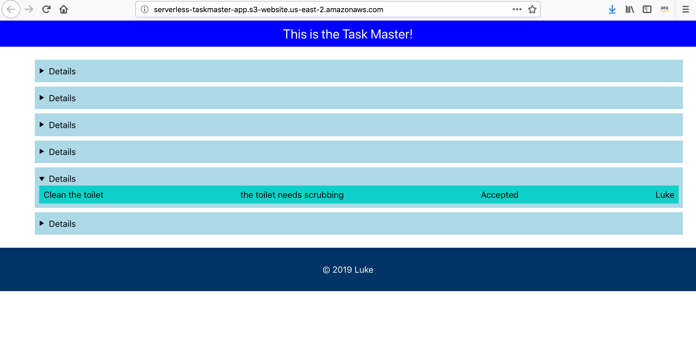

# Task Master

## Description 
- Task Master is a task-tracking application with the same basic goal as Trello: allow users to keep 
track of tasks to be done and their status. While we’ll start today with a basic feature set,
 we will continue building out the capabilities of this application over time.
 
## API

 
## Deployed Site (Front-End)
- http://serverless-taskmaster-app.s3-website.us-east-2.amazonaws.com/

## (Backend)
- http://taskmaster1-dev.us-east-2.elasticbeanstalk.com

## Screen Shots
